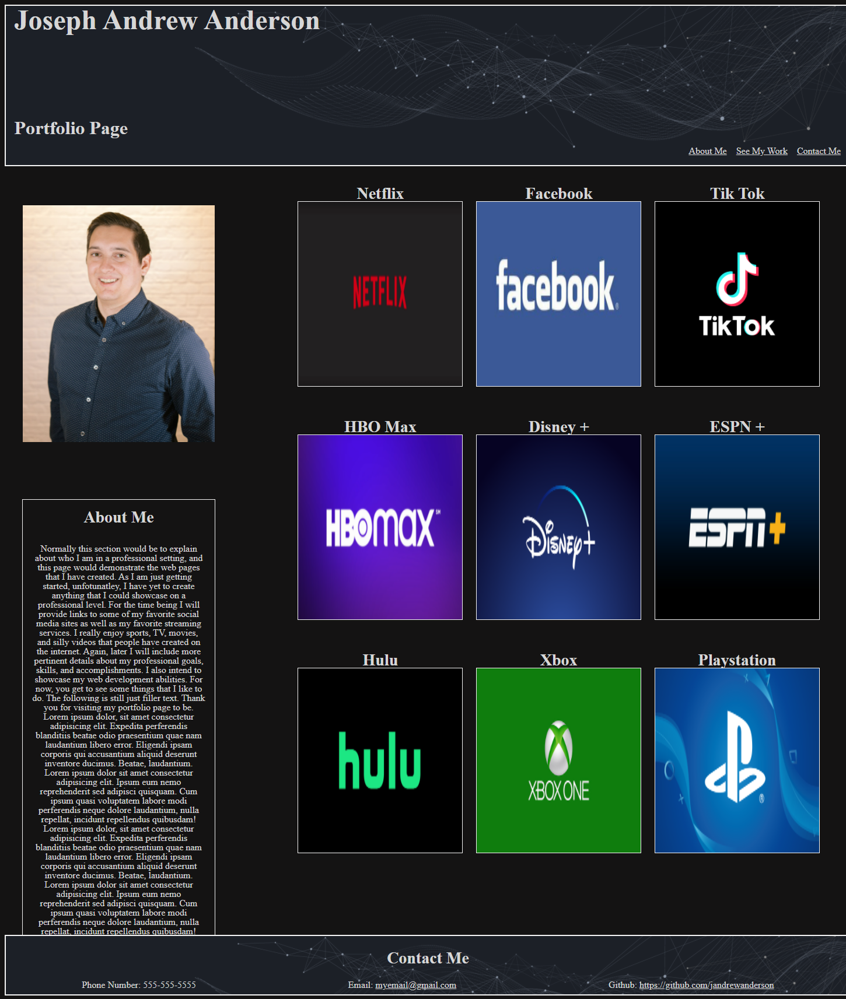

# advanced-css-portfolio

## Objectives

The purpose of this assignment was to create a page that will showcase my future work in web deveolopment. The page was intended to fit on all screen sizes as well as having links to different sections of the page as well as to outside sources.

## Screenshot of Final Page

## Link to the Final Page and GitHub

[Here is a link to my final page](https://jandrewanderson.github.io/advanced-css-portfolio/)

[Here is the link to my Github Repository](https://github.com/jandrewanderson/advanced-css-portfolio)

### Contributions

Joseph Andrew Anderson

### Resources
Shopify had the image for Netflix.
Mirror.co.uk image for Facebook.
Espn +
Disney +
Variety.com for the HBO Max image.
Tik Tok
Cnbl-cdn.bamgrid.com for the Hulu image.
Hulu
Wallpaper Flare website for the Xbox image.
Xbox
Gamespot.com for the Playstation image.
Playstation
https://www.w3schools.com/html/html5_semantic_elements.asp
https://www.pluralsight.com/guides/semantic-html

### License

This code is licensed under the MIT License.

